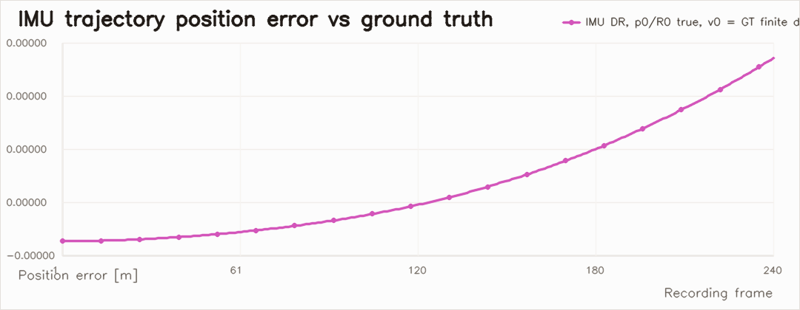
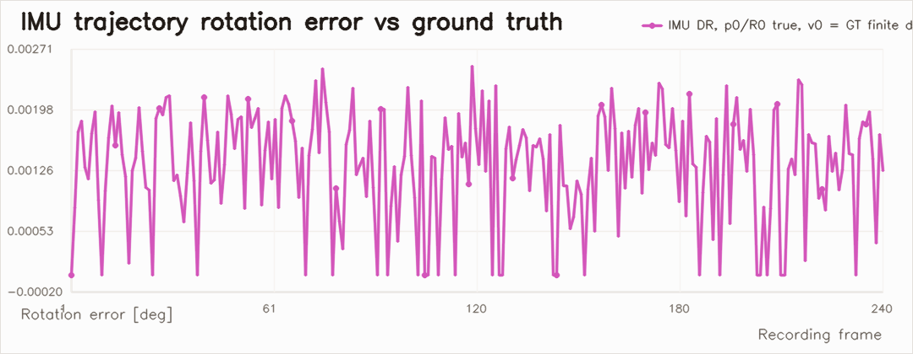
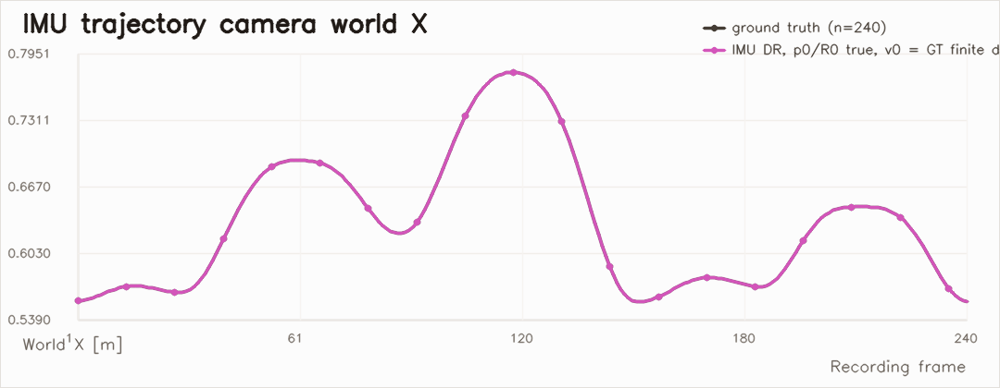
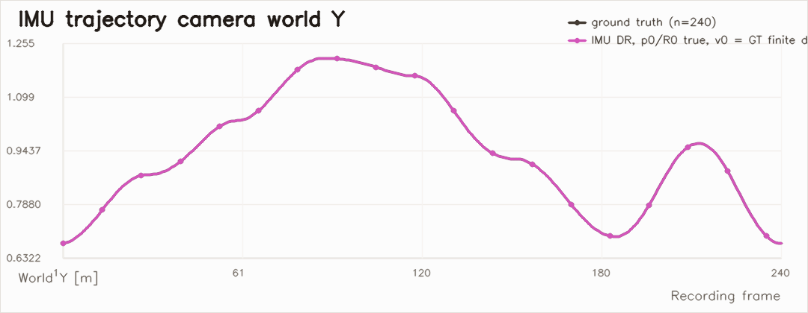
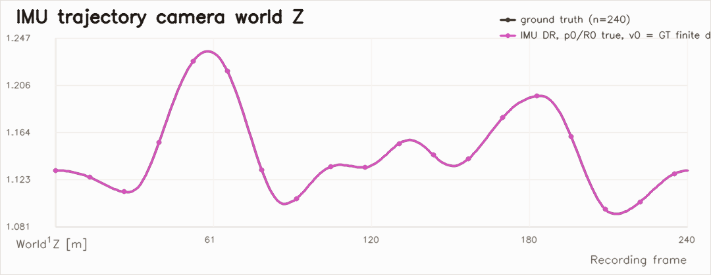
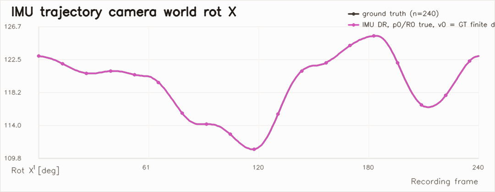
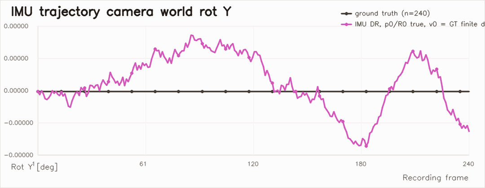
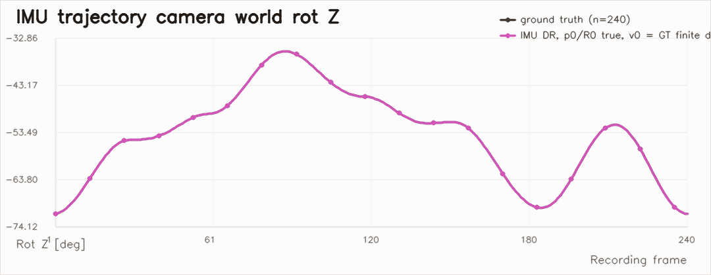

# Checkpoint 01

Checkpoint 01 is the first preserved repo state where the browser simulator, recording pipeline, AprilTag pose fitting, and IMU-only trajectory reconstruction all agree well enough to serve as a stable internal baseline.

Authoritative preserved run:

- `output/interactive_runs/run_20260406_083611/analysis/report.md`
- `output/interactive_runs/run_20260406_083611/analysis/imu_trajectory_report.md`

For the broader project context, see [../README.md](../README.md) and [README.md](README.md). The sendable PDF version of this checkpoint is [intermediate_report/main.pdf](intermediate_report/main.pdf).

## Scope

This checkpoint preserves:

- the tabletop challenge scene with smooth, repeatable robot motion
- wall tags plus cube-top tags for both far-range and near-range views
- a Pixel 9a-style processed-video camera model
- exact logging of phone video, IMU, and camera ground truth
- continuity-aware single-tag fitting
- joint all-points world-frame fitting
- IMU-only dead reckoning from exact persisted sim measurements

## Headline Results

Run metadata:

- Run directory: `output/interactive_runs/run_20260406_083611`
- Camera model: `pixel_9a_main`
- Frames analyzed: `240`
- Single-tag solved observations: `712`
- Joint world trajectory frames: `240`

Visual pose fitting:

- Single-tag mean position error: `0.0041908894 m`
- Single-tag median position error: `0.0023033761 m`
- Single-tag max position error: `0.1298972485 m`
- Single-tag mean rotation error: `0.2004393749 deg`
- Single-tag mean reprojection RMSE: `0.0457187084 px`
- Joint world mean position error: `0.0005711244 m`
- Joint world max position error: `0.0062955046 m`
- Joint world mean rotation error: `0.0805776745 deg`

IMU-only trajectory reconstruction:

- Initial velocity source: `logged_camera_gt_velocity`
- Mean position error: `2.1622285039e-07 m`
- Median position error: `1.4335684382e-07 m`
- Max position error: `7.1541862691e-07 m`
- Mean rotation error: `0.0013290944 deg`
- Max rotation error: `0.0025108593 deg`

## Environment

Checkpoint 01 uses the `tabletop_grab_challenge` scene and the `long_reach_tabletop` arm preset:

- arm base aligned with the table surface so the phone can sweep around the tabletop
- large wall tags for global reference
- top-mounted cube tags for close-range views
- smooth keyframed motion to support continuity-aware fitting

The current checkpoint scene is documented more fully in [app.md](app.md), in the LaTeX bundle guide [intermediate_report/README.md](intermediate_report/README.md), and in the rebuilt PDF [intermediate_report/main.pdf](intermediate_report/main.pdf).

## Visual Pose Estimation

The visual estimator uses the repo’s five-point tag measurement convention:

- point order: `center, top_right, bottom_right, bottom_left, top_left`
- camera-obscura seed for first observations in a streak
- warm starts from previous frame or previous world-frame estimate when available
- modified Newton with JAX gradients/Hessians and Armijo line search

Representative diagnostics from the preserved run:

The run-wide scalar diagnostics remain in a physically plausible range:

## World-Pose Trajectory From Tags

These plots compare:

- per-tag world-frame estimates
- the joint all-points world solution
- recorded simulator ground truth

World-frame position components:

World-frame XYZ Euler angles:

Per-tag summary:

| tag | observations | mean pos err [m] | median pos err [m] | max pos err [m] | mean rot err [deg] | mean reproj [px] |
| --- | ---: | ---: | ---: | ---: | ---: | ---: |
| `0` | 95 | 0.009502 | 0.009043 | 0.021088 | 0.306859 | 0.062819 |
| `19` | 180 | 0.006591 | 0.003267 | 0.129897 | 0.304375 | 0.059398 |
| `155` | 240 | 0.001637 | 0.001278 | 0.010225 | 0.127177 | 0.033330 |
| `201` | 197 | 0.002548 | 0.002135 | 0.009019 | 0.143408 | 0.040067 |

## IMU Trajectory Reconstruction

The IMU report for this checkpoint is based on the corrected logging path:

- exact `sim_time_s`
- exact body accelerometer and gyro values
- exact logged initial world velocity in `camera_gt.csv`
- simulator-consistent discrete integration:
  `R_k = R_{k-1} Exp(\omega_k dt)`, `v_k = v_{k-1} + a_k dt`, `p_k = p_{k-1} + v_k dt`

This is the key difference from the legacy run `run_20260405_141532`, which predates the exact IMU logging fix and should now be treated only as a historical diagnostic.

IMU scalar diagnostics:

IMU world-frame position components:

IMU world-frame XYZ Euler angles:

The important interpretation is simple: with corrected persistence of the simulator’s exact IMU stream, the IMU-only trajectory is effectively exact for this synthetic setup. That makes Checkpoint 01 a stable baseline for future visual-inertial work rather than only a camera-only pose-estimation checkpoint.

## Related Artifacts

The preserved run contains these supporting files:

- `analysis/report.md`
- `analysis/imu_trajectory_report.md`
- `analysis/pose_estimates.jsonl`
- `analysis/joint_world_estimates.jsonl`
- `analysis/imu_trajectory_estimates.jsonl`
- `analysis/per_tag/`
- `analysis/representative_observation.json`

The old IMU drift diagnosis remains useful as a historical note:

- `output/interactive_runs/run_20260405_141532/analysis/imu_drift_investigation.md`
