# Checkpoint 01 — Interactive Recording Analysis

This file snapshots the report from:

- `output/interactive_runs/run_20260405_141532/analysis/report.md`

It represents the first preserved checkpoint where:

- the browser app supports scene and robot-arm selection
- the tabletop challenge uses smooth motion with the arm base at table height
- single-tag estimation uses continuity-aware warm starts
- joint all-points estimation is accurate enough to serve as a reliable reference

For the broader checkpoint context, see [README.md](../README.md) and [docs/README.md](README.md).

## Overview

- Run directory: `output/interactive_runs/run_20260405_141532`
- Camera model: `pixel_9a_main` from `config/camera/pixel_9a_main.toml`
- Analysis input correction applied: `no`
- Frames analyzed: `240` out of `240` recorded samples
- Pose estimates produced: `712`
- Primary solver used in this report: `camera obscura seed + modified Newton + Armijo line search`

## Fit Implementation

State vector:
`x = [tx, ty, tz, rx, ry, rz]`, where translation is tag-to-camera in meters and `[rx, ry, rz]` is a Rodrigues rotation vector.

Observation model:
- The fitted observation is a 5-point image-plane vector in meters.
- Point order is `center, top_right, bottom_right, bottom_left, top_left`.
- The object points are a 10 cm square tag on the `z = 0` plane in tag coordinates.

Objective:
- Minimize the sum of squared image-plane residuals between predicted and observed 5-point measurements.
- Add a strong penalty when predicted depth goes non-positive.

Initialization and optimization:
1. Read the recorded raw phone video.
2. If the selected preset rendered a distorted image, undistort each frame before analysis; otherwise analyze the recorded frame directly.
3. Detect AprilTag 36h11 markers and build the 5-point measurement vector.
4. Convert image points into image-plane metric coordinates using the TOML focal length.
5. Build a camera-obscura seed from apparent tag scale and center offset.
6. Run a modified Newton solver with JAX autodiff gradients and Hessians. Start from the raw Hessian solve, and if that step is singular or not a descent direction, inject the smallest diagonal shift needed to recover a descent step before Armijo backtracking line search.
7. Keep the best result reached from the physically interpretable obscura seed.
8. Use the supplementary reports to compare against the older damped variant and against ground-truth-seeded runs.

## Representative Single-Pattern Solve

This section expands one solved observation in detail so the initialization and convergence are visible numerically.

- Frame/tick/time/tag: `171` / `172` / `14.333s` / `155`
- Selected seed: `previous_frame`
- Ground-truth camera position in tag coordinates: `[0.279846, 0.207941, 0.376193]` m
- Estimated camera position in tag coordinates: `[0.279632, 0.207464, 0.375813]` m
- Final translation tag->camera: `[0.065142, -0.115667, 0.494822]` m
- Final Rodrigues rotation vector: `[3.224997, -2.021050, -1.064014]` rad
- Position error: `0.000646` m
- Rotation error: `0.071212` deg
- Final reprojection RMSE: `0.000005` mm on the image plane = `0.001` px

### Units And Scale

- Tag size in this setup: `0.090` m
- Scene wall size: `3.200` m wide by `2.100` m high
- Camera-to-tag distance range across all solved observations: `0.430` m to `2.078` m, mean `0.996` m
- The `position_error_timeline.png` plot is a world-space camera-position error in meters, measured in the tag coordinate frame.
- The `reprojection_timeline.png` plot is an image-space reprojection RMSE in pixels, not world meters.

A useful sanity check is that the tags are only 10 cm wide and the camera is typically about 1.6 m away from a tag in this demo. So a 3 m world-position error really is huge, while a 1-3 px reprojection error is comparatively small.

### Pose Comparison Against Ground Truth

| row | meaning | camera position in tag frame [m] | distance to tag [m] | world error [m] | reproj [mm] | reproj [px] |
| --- | ---: | ---: | ---: | ---: | ---: | ---: |
| GT | Ground truth | [0.279846, 0.207941, 0.376193] | 0.512908 | 0.000000 | n/a | n/a |
| OBS | Camera obscura seed | [-0.072933, -0.129502, 0.554009] | 0.573599 | 0.519557 | 0.222817 | 31.804 |
| EX | Selected exact-operator result (previous_frame) | [0.279632, 0.207464, 0.375813] | 0.512319 | 0.000646 | 0.000005 | 0.001 |

The key thing to notice is that the corrected undamped solve no longer falls into the bad basin seen earlier. Here the camera-obscura seed starts far from truth, and the exact operator improves both the image fit and the world-space pose at the same time.

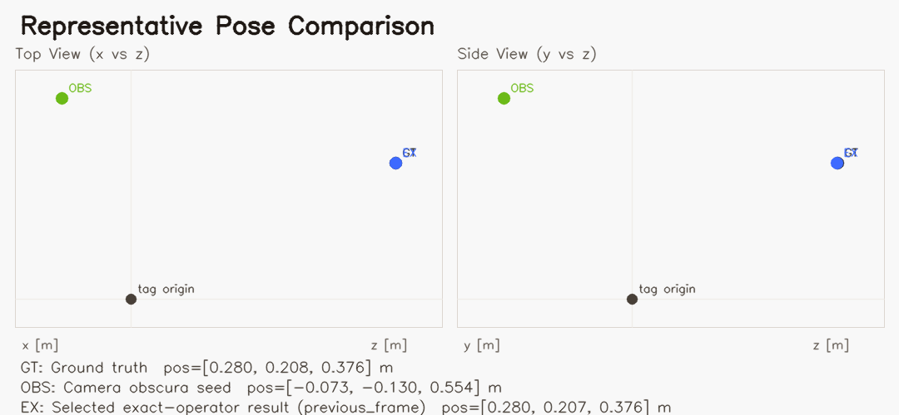

### Image Comparison On The Recorded Frame

- Ground-truth camera operator vs captured points: `0.422` px
- Final optimized camera operator vs captured points: `0.001` px
- Initial camera-obscura seed vs captured points: `31.804` px

Orange filled circles are the captured points from the recorded image.
Green crosses are the points produced by the minimizer camera operator when it uses the ground-truth pose.
Orange-red tilted crosses are the points produced by the same operator after optimization.

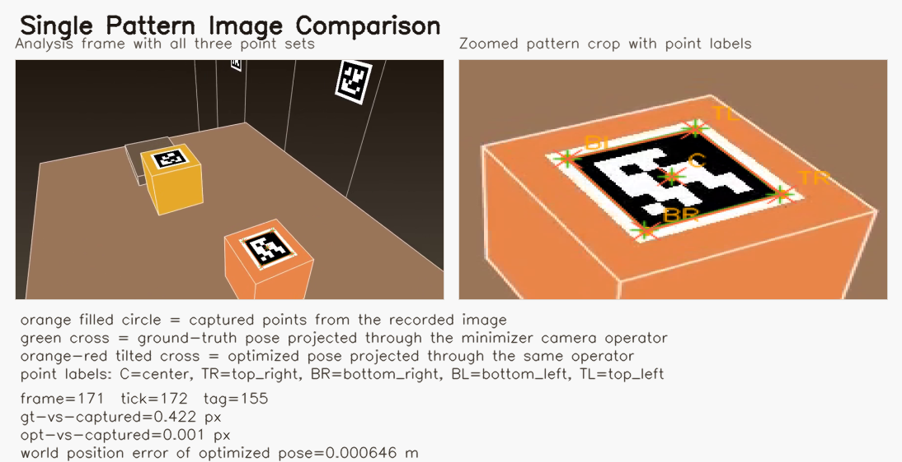

### Image-Plane Point Comparison

| point | captured px | gt operator px | optimized px | gt-captured dx,dy [px] | gt error [px] | opt-captured dx,dy [px] | opt error [px] |
| --- | ---: | ---: | ---: | ---: | ---: | ---: | ---: |
| `C` | [565.27, 422.96] | [564.85, 422.54] | [565.27, 422.96] | [-0.41, -0.42] | 0.588 | [0.00, 0.00] | 0.001 |
| `TR` | [620.90, 437.09] | [620.40, 436.63] | [620.90, 437.09] | [-0.50, -0.46] | 0.677 | [-0.00, 0.00] | 0.001 |
| `BR` | [551.85, 465.58] | [551.47, 465.09] | [551.85, 465.58] | [-0.37, -0.49] | 0.611 | [0.00, -0.00] | 0.001 |
| `BL` | [512.16, 409.47] | [511.81, 409.09] | [512.16, 409.47] | [-0.35, -0.38] | 0.519 | [-0.00, 0.00] | 0.001 |
| `TL` | [577.01, 385.67] | [576.56, 385.31] | [577.01, 385.67] | [-0.45, -0.36] | 0.579 | [0.00, -0.00] | 0.001 |

### Observed And Fitted 5-Point Measurement

Point order is `center, top_right, bottom_right, bottom_left, top_left`.

| point | pixel x | pixel y | obs x [mm] | obs y [mm] | fit x [mm] | fit y [mm] | dx [um] | dy [um] |
| --- | ---: | ---: | ---: | ---: | ---: | ---: | ---: | ---: |
| `center` | 565.27 | 422.96 | 0.596356 | -1.058903 | 0.596359 | -1.058908 | 0.003 | -0.005 |
| `top_right` | 620.90 | 437.09 | 0.986138 | -1.157890 | 0.986131 | -1.157892 | -0.006 | -0.002 |
| `bottom_right` | 551.85 | 465.58 | 0.502329 | -1.357492 | 0.502334 | -1.357487 | 0.005 | 0.005 |
| `bottom_left` | 512.16 | 409.47 | 0.224289 | -0.964415 | 0.224280 | -0.964418 | -0.008 | -0.003 |
| `top_left` | 577.01 | 385.67 | 0.678618 | -0.797679 | 0.678625 | -0.797674 | 0.007 | 0.004 |

### Camera Obscura Initial Guess

The pinhole-style seed uses the apparent tag scale to estimate depth, then back-projects the observed center:

`z0 = f * tag_size / average_observed_edge`

`tx0 = x_center * z0 / f`, `ty0 = y_center * z0 / f`

- Focal length used by the solver: `4.530000` mm
- Pattern size: `0.060000` m
- Observed center on the image plane: `[0.596356283, -1.058903481]` mm
- Observed edge lengths: top `0.473625` mm, bottom `0.481472` mm, right `0.523366` mm, left `0.483959` mm
- Average observed edge: `0.490606` mm
- Estimated depth from camera obscura: `0.554009` m
- Camera obscura seed state `[tx, ty, tz, rx, ry, rz]`: `[0.072933, -0.129502, 0.554009, 3.141593, 0.000000, 0.000000]`
- Camera obscura seed reprojection RMSE: `0.222817` mm

### Seed Competition

| seed | seed rmse [mm] | final rmse [mm] | final loss | termination |
| --- | ---: | ---: | ---: | ---: |
| `previous_frame` (selected) | 0.038420 | 0.000005 | 1.312842074e-16 | `small_step_or_gradient` |

### What The Three Main Poses Mean

- `OBS` is the raw camera-obscura seed before Newton. For this frame it is `0.519557` m away from ground truth, with `31.804` px reprojection error.
- `OBF` is unavailable for this observation.
- `EX` is the final exact-operator result chosen by the optimizer. For this frame it ends `0.000646` m away from ground truth, with `0.001` px reprojection error.

For this representative frame, the corrected solver resolves the earlier mismatch: the exact operator finds a pose that matches the image much better than the obscura seed and is also very close to the recorded ground truth in world coordinates.

### Newton Convergence From Camera Obscura Seed

This is the requested pinhole-style seed followed by the corrected modified Newton steps on the full fitted observation model used in this run.
The `gt - cam pos [m]` column is `ground_truth_position - current_estimate_position` and the `gt - rot xyz [deg]` column is the XYZ Euler-angle error vector of the relative rotation from estimate to ground truth.

_No rows available._

### Newton Convergence For The Selected Seed

The obscura path is shown above, but this representative observation ultimately converged to a lower final objective from the `previous_frame` seed.
The pose-error vector columns use the same `ground truth - current estimate` convention as above.

| iter | loss before | grad norm | step norm | damping | alpha | accepted | loss after | rmse after [mm] | gt - cam pos [m] | gt - rot xyz [deg] | min depth [m] |
| --- | ---: | ---: | ---: | ---: | ---: | ---: | ---: | ---: | ---: | ---: | ---: |
| 0 | 7.380577663e-09 | 2.478948940e-06 | 8.250074951e-02 | 0.0e+00 | 1.0000 | `yes` | 5.514863526e-10 | 0.010502 | [0.000586, 0.000745, 0.036014] | [1.701, -2.340, -0.037] | 0.435630 |
| 1 | 5.514863526e-10 | 3.239367674e-07 | 5.944579516e-02 | 0.0e+00 | 1.0000 | `yes` | 9.328391401e-12 | 0.001366 | [0.000011, 0.000070, 0.005899] | [0.269, -0.400, 0.034] | 0.457987 |
| 2 | 9.328391401e-12 | 2.671190675e-08 | 1.043252365e-02 | 0.0e+00 | 1.0000 | `yes` | 4.488544599e-15 | 0.000030 | [0.000201, 0.000459, 0.000514] | [-0.014, -0.051, 0.053] | 0.461727 |
| 3 | 4.488544599e-15 | 3.587000446e-10 | 2.703053466e-04 | 0.0e+00 | 1.0000 | `yes` | 1.312842074e-16 | 0.000005 | [0.000214, 0.000476, 0.000381] | [-0.021, -0.042, 0.053] | 0.461812 |
| 4 | 1.312842074e-16 | 9.570669301e-14 | 9.570669301e-14 | 1.0e+01 | 0.0000 | `no` | 1.312842074e-16 | 0.000005 | [0.000214, 0.000476, 0.000381] | [-0.021, -0.042, 0.053] | 0.461812 |

Machine-readable details for this observation are saved in `analysis/representative_observation.json`.

## Results

- Mean position error: `0.004190889448962348` m
- Median position error: `0.0023033761009373308` m
- Min position error: `0.0003156873702581971` m
- Max position error: `0.12989724854599805` m
- Mean position error in tag widths: `0.04656543832180387`
- Mean position error relative to mean camera-tag range: `0.004209189189111589`
- Mean rotation error: `0.20043937491945532` deg
- Mean image-plane reprojection RMSE: `3.2030673629878177e-07` m = `0.0003203067362987818` mm = `0.04571870836607693` px
- Median image-plane reprojection RMSE: `2.2453815760958765e-07` m = `0.00022453815760958766` mm = `0.03204926210241554` px
- Camera-to-tag distance across the run: `0.42995279480105303` m to `2.0776641643827705` m, mean `0.9956524310675845` m

## Per-Pattern Breakdown

These rows are already solved separately for each visible calibration pattern; the reports under `analysis/per_tag/` expose the same split explicitly.

## World-Pose Components By Tag

Each plot uses recording frame number on the x axis. The estimate lines are solved from each calibration pattern independently and then transformed back into the shared world frame using that pattern's recorded world pose for the same frame. The purple line is a true joint solve over all visible tag points in that frame.

- Joint world-trajectory frames solved: `240`
- Joint world mean position error: `0.0005711243517928374` m
- Joint world median position error: `0.0003475039445508874` m
- Joint world max position error: `0.006295504562321475` m
- Joint world mean rotation error: `0.08057767448493894` deg
- Joint world mean reprojection RMSE: `0.08426240558978298` px

World-frame position components:

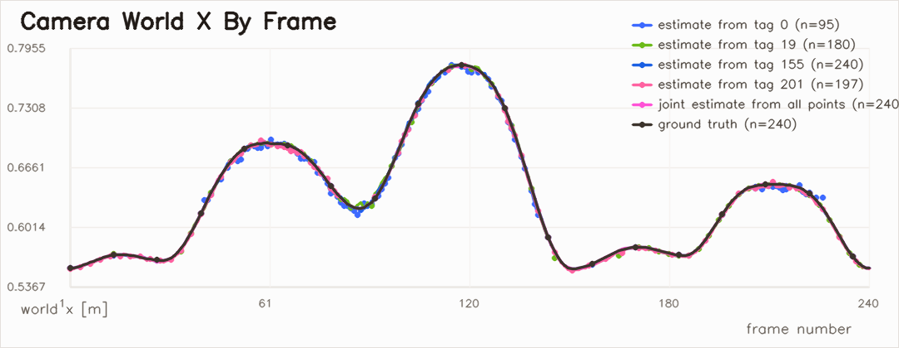

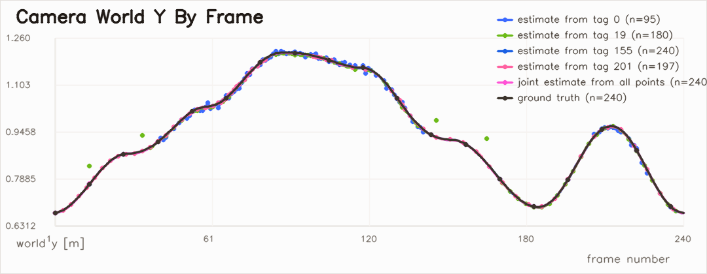

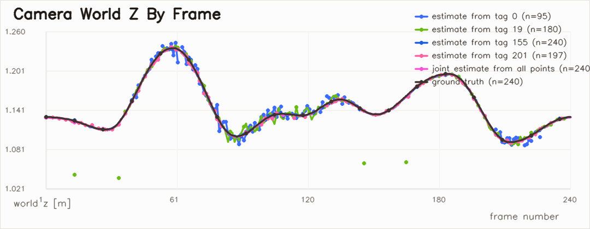

World-frame XYZ Euler angles of the camera-to-world rotation:

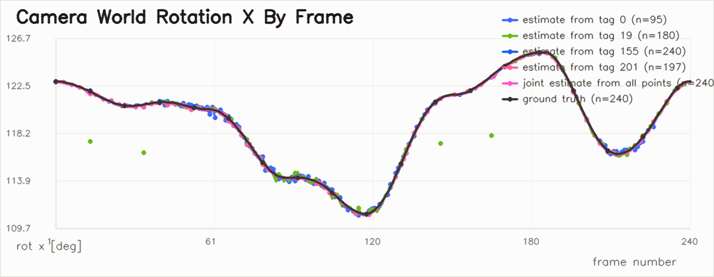

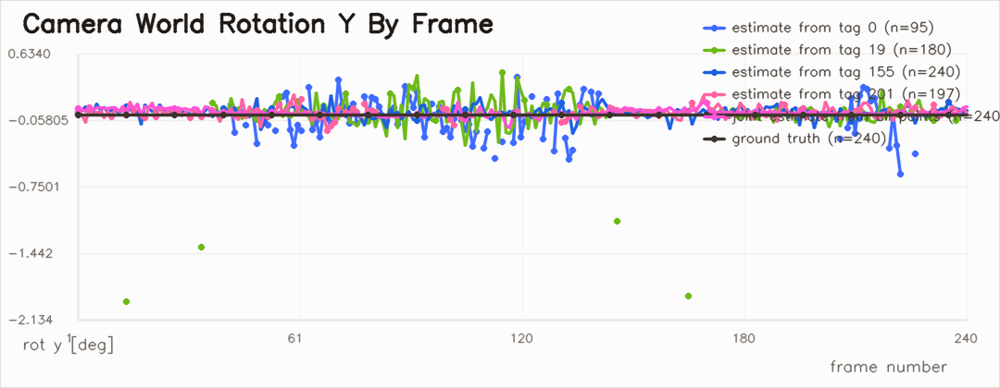

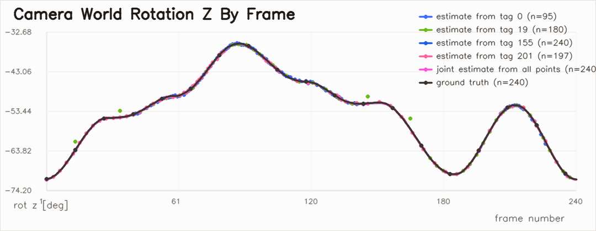

| tag | observations | mean pos err [m] | median pos err [m] | max pos err [m] | mean rot err [deg] | mean reproj [px] |
| --- | ---: | ---: | ---: | ---: | ---: | ---: |
| `0` | 95 | 0.009502 | 0.009043 | 0.021088 | 0.306859 | 0.062819 |
| `19` | 180 | 0.006591 | 0.003267 | 0.129897 | 0.304375 | 0.059398 |
| `155` | 240 | 0.001637 | 0.001278 | 0.010225 | 0.127177 | 0.033330 |
| `201` | 197 | 0.002548 | 0.002135 | 0.009019 | 0.143408 | 0.040067 |

## Visual Diagnostics

Representative best-reprojection frame:

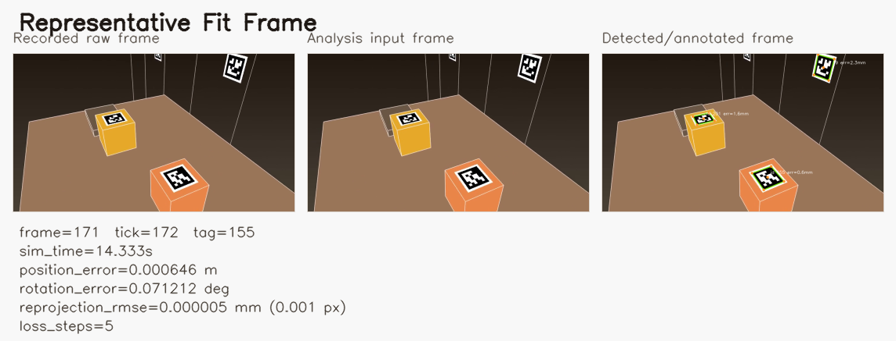

Representative world-space pose comparison:

World-space position error over all solved observations. This is measured in meters in the tag coordinate frame, so it should be read against the roughly 1.6 m camera-to-tag scale of the demo scene:

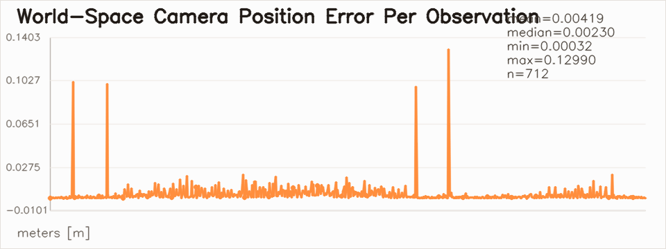

Image-space reprojection RMSE over all solved observations. This plot is in pixels, not world meters:

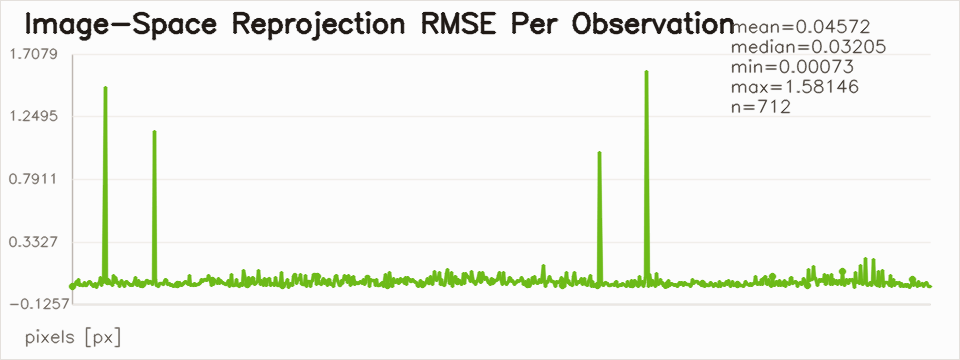

Representative optimizer loss trace:

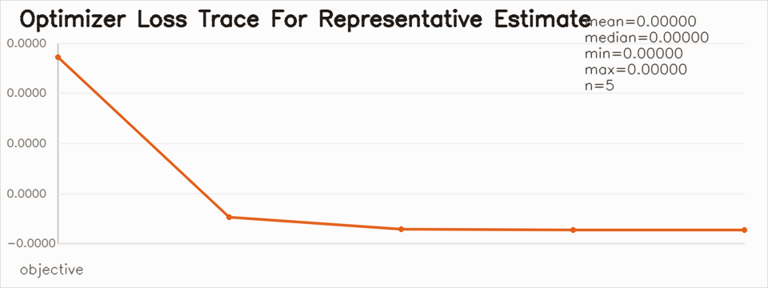

## Interpretation

Using the corrected modified Newton method removes the main failure mode we saw when the raw Hessian step was silently discarded and replaced by an almost-zero gradient fallback.
In this run the average world-space camera-position error is `0.004190889448962348` m while the camera is typically about `0.9956524310675845` m from a tag, which is much more physically plausible than the earlier meter-scale failures.
The supplementary synthetic report shows that the undamped solver reaches the zero-loss branch much more reliably, and the ground-truth-seeded real-measurement report shows the optimizer behaves well locally around the true pose on the noisy detected points.
The remaining residual error in this report is now better interpreted as a combination of detector noise, single-tag ambiguity, and seed sensitivity rather than a broken forward camera model or an intrinsically bad Newton formulation.

## Artifacts

- Undistorted video: `analysis/phone_undistorted.mp4`
- Detected/annotated video: `analysis/phone_undistorted_detected.mp4`
- Per-frame estimates: `analysis/pose_estimates.jsonl`
- Per-frame joint world estimates: `analysis/joint_world_estimates.jsonl`
- Summary JSON: `analysis/summary.json`
- Single pattern report: `analysis/single_pattern_report.md`
- Single pattern overlay: `analysis/single_pattern_overlay.png`
- Worst single pattern report: `analysis/worst_single_pattern_report.md`
- Worst single pattern overlay: `analysis/worst_single_pattern_overlay.png`
- Real measurement ground-truth-seed report: `analysis/real_measurement_known_solution_report.md`
- Synthetic single pattern report: `analysis/synthetic_single_pattern_report.md`
- Synthetic single pattern overlay: `analysis/synthetic_single_pattern_overlay.png`
- Representative pose comparison image: `analysis/representative_pose_comparison.png`
- Representative observation JSON: `analysis/representative_observation.json`
- Per-tag directory: `analysis/per_tag`
- Per-tag summary JSON: `analysis/per_tag_summary.json`
- World-pose-by-tag directory: `analysis/world_pose_by_tag`
- World X plot: `analysis/world_pose_by_tag/camera_world_x_m.png`
- World Y plot: `analysis/world_pose_by_tag/camera_world_y_m.png`
- World Z plot: `analysis/world_pose_by_tag/camera_world_z_m.png`
- World rot X plot: `analysis/world_pose_by_tag/camera_world_rx_deg.png`
- World rot Y plot: `analysis/world_pose_by_tag/camera_world_ry_deg.png`
- World rot Z plot: `analysis/world_pose_by_tag/camera_world_rz_deg.png`
